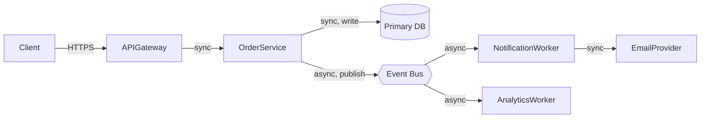
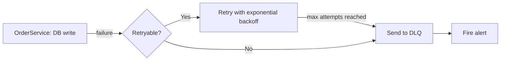

# Data Flow Design Template

**Target**: `docs/api/data-flow.md`

## Data Flow Between Components (Mermaid)

## Sync/Async Pattern Inventory

| Flow | Type | Rationale |
|---|---|---|
| Client → APIGateway → OrderService | Sync | The user needs the result back immediately |
| OrderService → EventBus → NotificationWorker | Async | Email delivery delay doesn't affect user experience |

## Error-Handling Flow (Mermaid)

## Design Notes

- Document the max retry count and backoff strategy for each async process (see `error-handling.md` for details)
- Document which operations require idempotency (handling duplicate message delivery)
- If there are many components, feel free to split the flow diagram by use case
