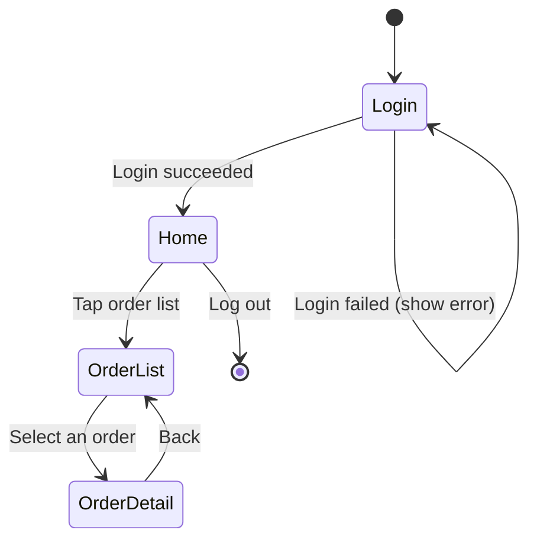

# Screen Inventory & Screen Transition Template

**Target**: `docs/client/ui-ux.md`

## Screen Inventory

| Screen | Path/Route | Purpose | Auth Required |
|---|---|---|---|
| Login | `/login` | Enter credentials | No |
| Home | `/home` | Entry point for the main flows | Yes |
| Order list | `/orders` | View your order history | Yes |
| Order detail | `/orders/:orderId` | View details of a single order | Yes |

## Screen Transitions (Mermaid)

## Design Notes

- If there are many screens, feel free to split the transition diagram by feature domain
- For UI that's ambiguous as a "screen" (modals, dialogs), document the policy for whether to include it here
- For screens reachable via deep link / direct external navigation, note that in the screen inventory
- Per-screen detail design (component usage, event behavior) belongs in `screen-<name>.md` (`client-screen-template.md`) — keep this file limited to the screen inventory and transition flow
