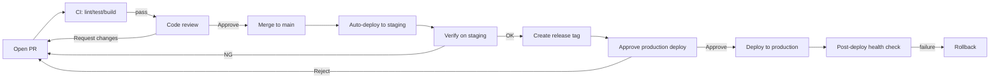

# Deployment Design Template

**Target**: `docs/infrastructure/deployment.md`

## Environment Matrix

| Environment | URL | Branch | Deploy Trigger | Approval Gate | Infrastructure |
|---|---|---|---|---|---|
| dev | `dev.example.com` | `develop` | Automatic on push | None | Shared (low-cost setup) |
| staging | `staging.example.com` | `main` | Automatic on merge to main | None | Production-equivalent setup |
| production | `example.com` | Tag on `main` | Tag push | Manual approval, 1+ approver | Production setup |

## Deployment Flow (including review/approval)

## Rollback Strategy

| Item | Detail |
|---|---|
| Detection method | (e.g. health-check failure, error-rate threshold exceeded, manual judgment) |
| Execution method | (e.g. redeploy the previous tag, Blue/Green switch-back) |
| Target recovery time (RTO) | (e.g. within 15 minutes) |
| Notes for changes involving data | (e.g. prepare a separate rollback procedure in advance for destructive migrations) |

## Design Notes

- Document the deployment strategy (in-place / Blue-Green / Canary, etc.)
- Document who approves the gate and how (GitHub Environments, Slack approval, etc.)
- Document where secrets/environment variables are managed and how per-environment values differ
