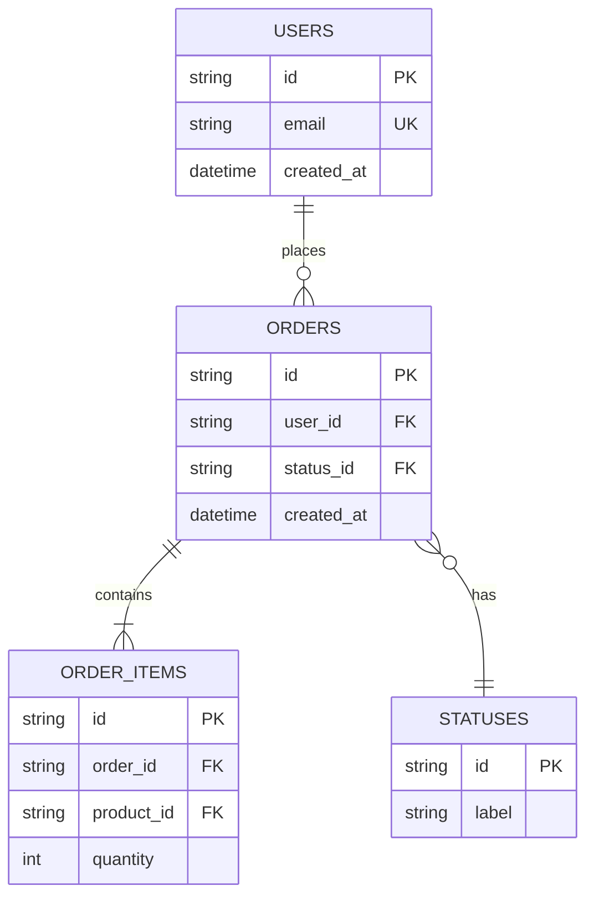

# ER Diagram Template (Mermaid)

**Target**: table/collection-style stores (RDB, document DB, or other schemas with relationships)
**Note**: Don't use this template for stores without relationships, such as KVS or object storage. Use `schema-dynamodb-access-patterns-template.md` for DynamoDB and `schema-redis-key-design-template.md` for Redis.

Scale the number of entities and relationships to match the project.

## Notation Notes

- Relationship notation: use `||--o{` (one-to-many), `||--||` (one-to-one), `}o--o{` (many-to-many) as appropriate
- Mark PK/FK/UK explicitly on each entity block
- You don't need to list every column — it's fine to limit it to the attributes that matter for the design (primary keys, foreign keys, unique constraints, required business attributes)
